# Proyecto Maven y GitHub

Este proyecto tiene como objetivo automatizar y estandarizar el flujo de vida de la construcción de software con **Maven**, además de administrar versiones con **Git** en un repositorio remoto de **GitHub**.
Autor: Diego Hernando Chicuazuque Castiblanco

## 📌 Prerrequisitos
- Tener instalado [Java](https://www.oracle.com/java/technologies/javase-jdk11-downloads.html)
- Tener instalado [Maven](https://maven.apache.org/download.cgi)
- Tener instalado [Git](https://git-scm.com/)
- Tener una cuenta en [GitHub](https://github.com/)

---

## 🚀 Creación de un proyecto Maven
Ejecuta el siguiente comando para generar un proyecto Maven:
```sh
mvn archetype:generate -DgroupId=com.ejemplo -DartifactId=mi-proyecto -DarchetypeArtifactId=maven-archetype-quickstart -DinteractiveMode=false
```
Esto generará una estructura básica para tu proyecto.


Commando usado
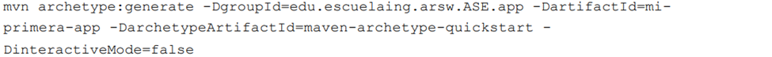

Evidencia compilación
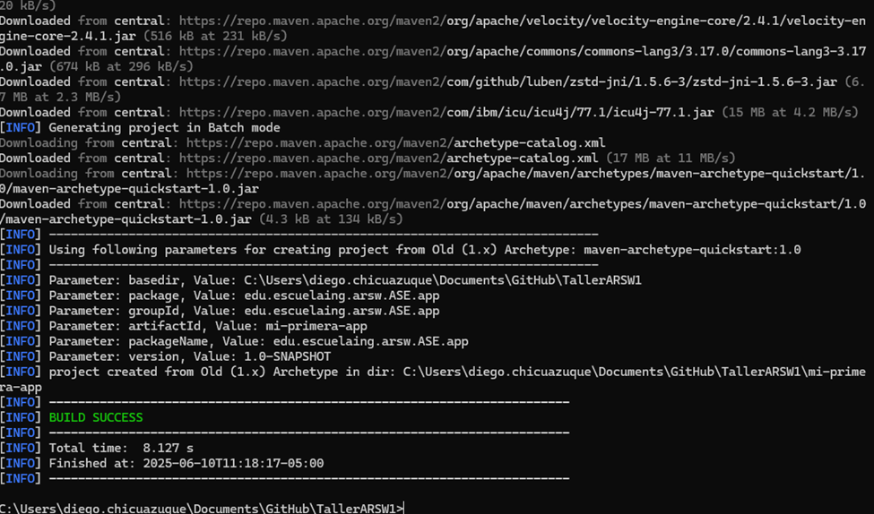

Como queda el arbol al final

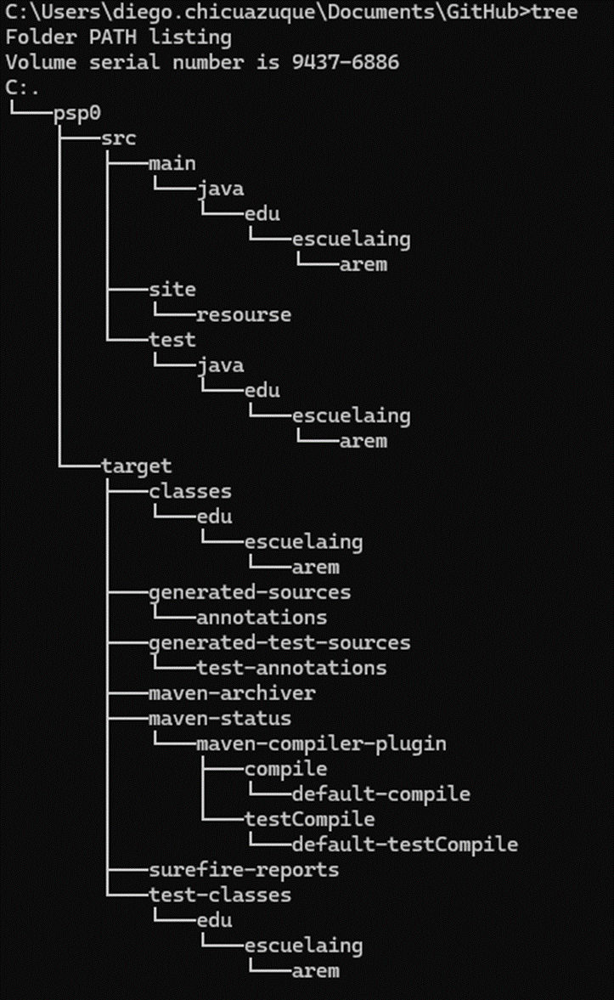

---

## 🔧 Inicializar Git y conectar con GitHub
1. **Navega al directorio del proyecto**:
   ```sh
   cd mi-proyecto
   ```
2. **Inicializa un repositorio Git**:
   ```sh
   git init
   ```
3. **Agrega y confirma cambios**:
   ```sh
   git add .
   git commit -m "Inicialización del proyecto Maven"
   ```
4. **Conectar con el repositorio remoto**:
   ```sh
   git remote add origin https://github.com/tu-usuario/tu-repositorio.git
   ```
5. **Subir los cambios al repositorio**:
   ```sh
   git push -u origin main
   ```

6. **Revisamos el estado de 
como quedó todo**:

   ```sh 
   git status
   ```
 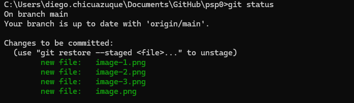

 En este caso se ve que el estado es correcto ademas de que, faltan por subir nuevos cambios los cuales fueron generados debido a que este readme fue realizado mientras se tomaban evidencias

 pero basta con hacer un commit y revisar de nuevo el status

 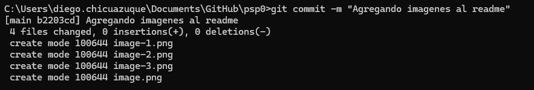

 y ahora revisamos de nuevo el status, para esto primero hacemos un git push
 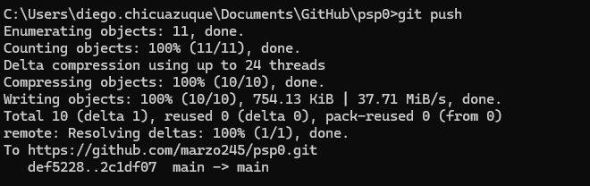

 y seguido de esto revisamos el status

 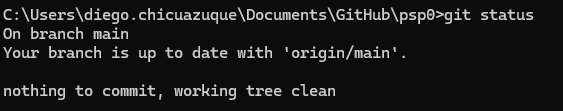
---

## 📦 Construcción y empaquetado del proyecto
Para compilar y empaquetar el código fuente en un `.jar`:
```sh
mvn package
```
El archivo resultante se encontrará en la carpeta `target/`.

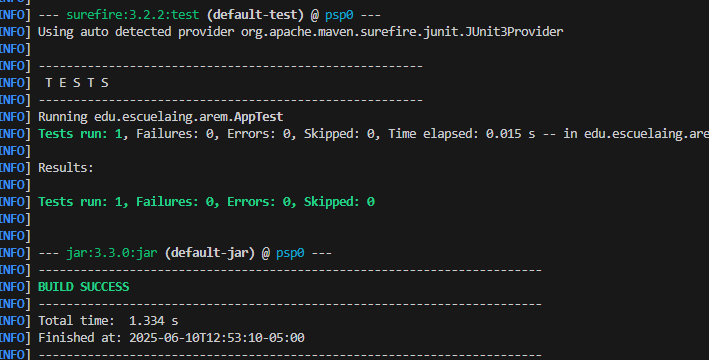

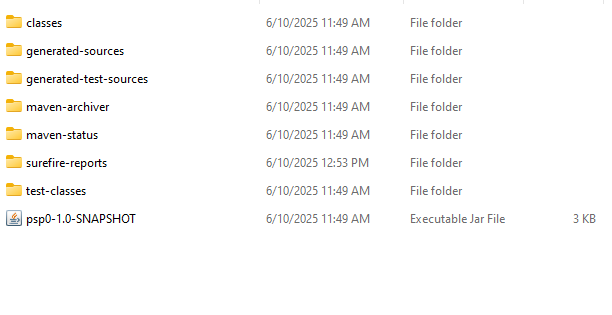
---
### 📦 Configuracion adcional para ignorar los /target en los commit
Muchas veces no es necesario subir nuestros .class ya que estos suelen ocupar espacio inecesario en nuestros repositorios, por lo que acudimos a el .gitignore para evitar siempre que hagamos un commit estar subiendo estos.
Para esto hacemos uso de lo siguiente en nuestro .gitignore 

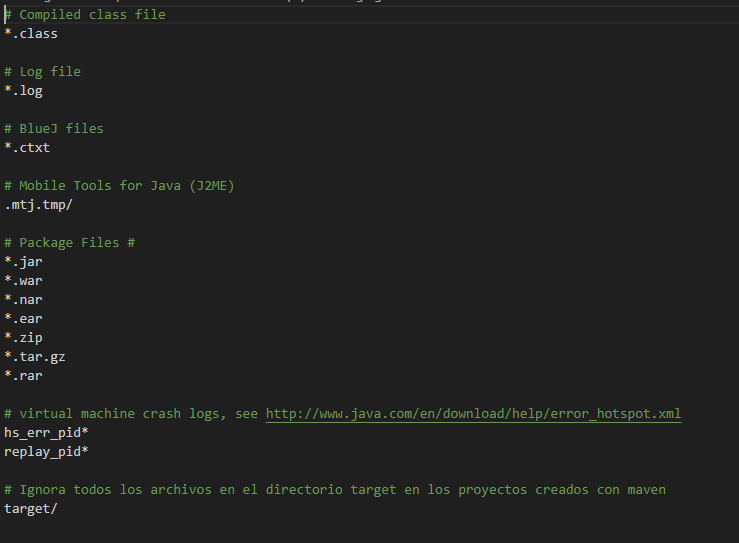

En esta evidenciamos, en la ultima linea que se agreag el target/
Esto lo que hace es ignorar la carpeta target y su contenido a la hora del versionamiento.
---
## 📦 Evidencias
Estas estaran en un word con los pantallazos correspondientes

### Crendo un Proyecto
Evidencia de compilacion de creacion de packetes con commando


Aqui evidenciamos el como compilo correctamente el packete de maven con el comando mvn package

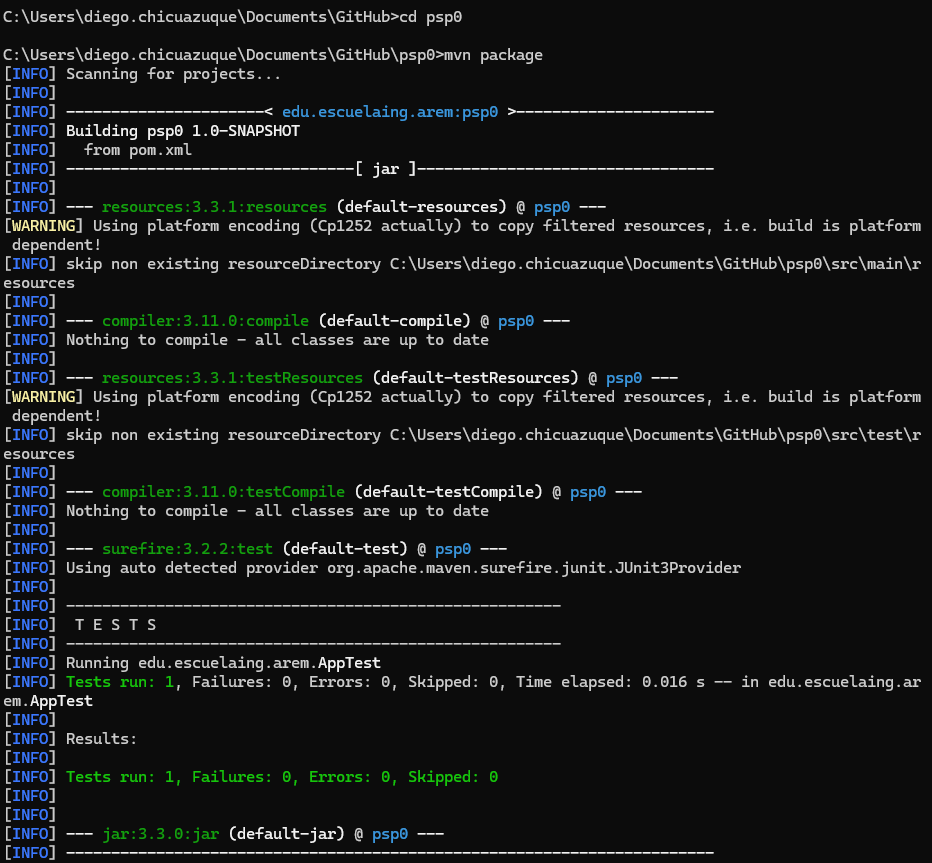


## ✅ Ejecutar el proyecto
Para ejecutar la aplicación generada:
```sh
java -jar target/mi-proyecto-1.0-SNAPSHOT.jar
```

---

---

## 📄 Licencia
Este proyecto está bajo la licencia GNU.

---

